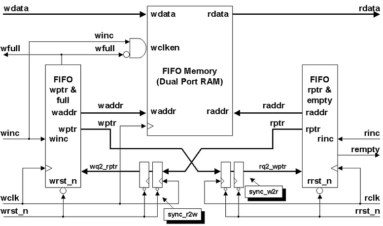

# 01: Asynchronize FIFO
Language: Verilog 
Platform: **EDAplayground** or Vivado 
Simulator: **Synopsys VCS 2020.3** or Vivado Simulator   

[-> Code on EDAplayground](https://www.edaplayground.com/x/dQzx)

# FIFO block diagram

# testing environment

# module description

### 1. Producer
- controls winc, wdata to Async_FIFO mopdule. 
- wdata is a up counter start from 1.
### 2. Reciever
- controls rinc to Async_FIFO mopdule. 
- checks whether the rdata read from FIFO is correct.(compared rdata with recieve counter)
### 3. Async_FIFO
- recieves wdata from Producer.
- sends rdata to Receiver.
### 4. FIFO_MEM
- a simple dual port memory
- wirte port: provides synchrous write at the wclk's posedge.
- read port: provides asynchrous read 

# implementation details

### 1. binary2gray [[1]](#Reference)

### 2. gray2binary [[2]](#Reference)

### 3. comparison [[3]](#Reference)
- I extend one more bit on the pointer. By comaring the first bit and the rest four bits of the two pointer, the system can simply determines wfull and rempty signals. 
- For example, when the write pointer counts to 5'b10000 and the read pointer counts to 5'b00000, the FIFO is full. It can be calculated by:
- assign wfull = ( {~wptr[4],wptr[3:0]}, rptr )? 1 : 0;
- assign rempty = ( wptr, rptr )? 1 : 0;

### 4. FIFO depth (not power of 2) [[3]](#Reference)
- To design a gray counter which is not power of 2, we need to make gray counter's start count is only one bit different with end count. 
- Here is the formula to calculate.

- For example, I set FIFO depth equal to 10 in my design. The binary cpunter counts from 3 to 12 (from 2^4 - 10/2 to 2^4 - 10/2 +1). Thus, the gray code counts from 0010 to 1010. Then, counter inverts wptr[4] and repeat to 0010.
- assign wptr_next = (wptr[3:0] >= 4'd12)? {~wptr[4],4'd3}: wptr+1;

decimal | binary | gray
-|-|-
3| 0011 | 0010
4| 0100 | 0110
5 | 0101 | 0111
6 | 0110 | 0101
7 | 0111 | 0100
8 | 1000 | 1100
9 | 1001 | 1101
10 | 1010 | 1111
11 | 1011 | 1110
12 | 1100 | 1010

# discussion

1.Why use gray code counter in Asynchronous FIFO?
- if the counter changes more than one bit in the next clock, the output of synchronizer may occur unexpected output in the switch process. This unexpected output may cause error in wfull or rempty signals.
- For example, if counter changes from 101 -> 110, the output of synchronizer may switch like 101-> 111 -> 110 in a very short period. 

2.what is the purpose of already_wfull and already_rempty signals?
- already signals can help master control wdata with less logic.
- When the producer recieves an wfull signal, it needs to wait until FIFO is not full and to reproduce the previous wdata. If the producer does not reproduce the wdata, FIFO will miss the wdata as the first waveform.

- But if producer recieves an already_wfull signal, it just need to wait until FIFO is not already full. Producer does not need to reproduce the previous wdata.

# Reference

[1]: [Conversion of Binary to Gray Code](https://www.tutorialspoint.com/conversion-of-binary-to-gray-code)  
[2]: [Conversion of Gray Code to Binary](https://www.tutorialspoint.com/conversion-of-gray-code-to-binary)  
[3]: [What is Asynchronous FIFO? || Asynchronous FIFO DESIGN (Clock Domain crossing) Explained in detail.](https://www.youtube.com/watch?v=0LVHPRmi88c)  
